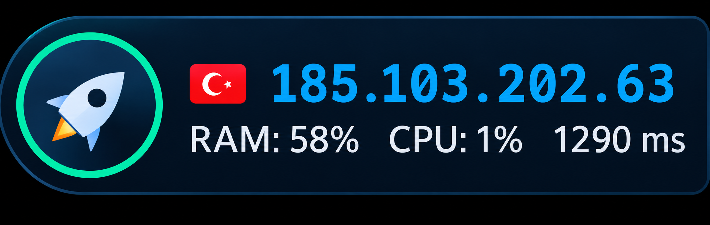

<div align="center">

# 🚀 Rocket Monitor

**A tiny desktop widget that shows your live public IP, country flag, ping, RAM and CPU, all in one sleek capsule.**


<br>

<!-- Replace with your own screenshot -->


<sub>Sits quietly in the top-right corner of your desktop. Never covers your apps.</sub>

</div>

---

## ✨ Features

| | |
|---|---|
| 🌍 **Live public IP** | Updates every few seconds and flashes red the moment your IP changes (VPN on/off, reconnects, Tor, proxy switches). |
| 🏳️ **Country flag, ISP and ASN** | Built-in vector flags for common countries, so they work even when flag CDNs are blocked. |
| 📡 **Works behind filtering** | Tries many sources in parallel, then falls back to direct connections and finally plain **DNS**, so it keeps working where HTTP IP services are blocked. |
| 📊 **RAM, CPU and ping** | Lightweight system stats read straight from Windows. No extra packages. |
| 🚀 **One-click RAM clean** | Click the rocket: it shakes, launches, comes back, and reports how much memory was freed. |
| 🖥️ **Desktop-level window** | Lives *on* the desktop, below your apps. Frameless, translucent, no taskbar entry. |
| 🔔 **Sound alerts** | Soft built-in Windows sounds: *chimes* when your IP changes, *Speech Off* when the connection drops, *Speech On* when it comes back. Toggle from the menu. |
| 🎨 **7 color themes** | Capsule, Midnight, Graphite, Aurora, Emerald, Sunset and Paper (light). Remembered between runs. |
| ⚡ **Start with Windows** | Enabled on first run, toggle any time from the menu. |
| 🧲 **Auto-sizing** | Width follows the content and stays glued to the screen edge, no wasted space. |

---

## 📦 Installation

```bash
git clone https://github.com/<your-username>/ip-overlay.git
cd ip-overlay
pip install PySide6
python ip_overlay_v3.py
```

> **Tip:** use `pythonw ip_overlay_v3.py` to run without a console window.

**Requirements:** Windows 10/11, Python 3.10+, and `PySide6`. That's it. Everything else uses the standard library.

---

## 🖱️ Usage

| Action | Result |
|---|---|
| **Click the rocket** | Clean RAM (with animation) |
| **Drag** | Move the capsule |
| **Double-click** | Copy the current IP |
| **Right-click** | Menu: Copy IP · Theme · Display · Snap to corner · Sound alerts · Clean RAM · Start with Windows · Quit |

### Status colors

The ring around the rocket shows connection state:

- 🟢 **Green**: online
- ⚪ **Grey**: connecting
- 🔴 **Red**: offline (the last known IP stays on screen, dimmed)

---

## 🧠 How it detects your IP

Public IP services are often blocked or unreliable, so detection runs in stages and stops at the first success:

1. **Last working method** (fast path, minimal traffic)
2. **12 HTTP(S) services in parallel** through your system proxy settings
3. **Same services, direct connection** (ignores a stale or dead system proxy)
4. **DNS lookup** over UDP 53 (OpenDNS and Google), which often works when HTTP is filtered

Location data (country, city, ASN, ISP) comes from several geo-IP providers raced in parallel, with a **DNS-based fallback** (Team Cymru) that can still return country, ASN and ISP when HTTP geo services are unreachable.

---

## ⚙️ Configuration

Settings are stored in `%APPDATA%\IPOverlay\config.json` (theme, screen, autostart flag). Downloaded flags are cached in `%APPDATA%\IPOverlay\flags\`.

To remove everything: turn off **Start with Windows** in the menu, quit, then delete that folder.

---

## ❓ FAQ

**Does "Clean RAM" really free memory?**
It trims the working set of every process it can access. The RAM percentage drops right away, but Windows brings pages back as apps need them, so the effect is temporary. Think of it as a quick reset, not a permanent fix. Running as administrator lets it reach more processes.

**The widget is on the wrong monitor.**
Right-click → **Display** and pick your screen. The choice is saved.

**Offline, but my internet works.**
All detection methods failed. Check that Python is allowed through your firewall and that your VPN routes its traffic.

**Does it send my data anywhere?**
It only contacts public IP and geo-IP services to look up your own address, plus flag image hosts when a flag isn't built in. There is no telemetry and no account.

---

## 🗺️ Roadmap

- [ ] Desktop notification on IP change
- [ ] DNS leak check
- [ ] IP change log to file
- [ ] IPv6 support
- [ ] Packaged `.exe` release

---

## 🤝 Contributing

Issues and pull requests are welcome. If you add a built-in flag, add its entry to the `STRIPES` table or `draw_flag()`.

## 📄 License

MIT. See [LICENSE](LICENSE).

<div align="center">
<sub>Made with 🚀 and a lot of ping.</sub>
</div>
